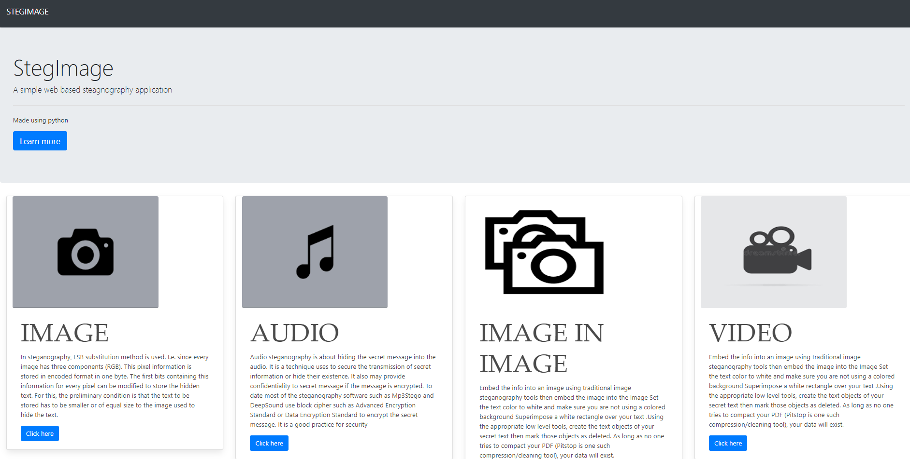

# StegImage: Web-Based Image, Audio, and Video Steganography Tool

StegImage is a powerful and user-friendly web application that allows you to hide secret messages within various media formats, including images, audio files, and videos. Developed with React and leveraging Django Python for robust encryption and decryption, StegImage offers a seamless and secure way to protect your sensitive information.

## Features:

### Multiple Steganography Options:
Choose from four different methods to conceal your data:
- **Hide Text in Image:** Embed a secret message within an image file.
- **Hide Text in Audio:** Encode your message into an audio file.
- **Hide Image in Image:** Conceal one image inside another for double the secrecy.
- **Hide Message in Video:** Securely store your message within a video file.

### Encoding and Decoding:
Each option comes with both encoding and decoding functionalities, allowing you to hide and retrieve your messages with ease.

### Password Protection:
Add an extra layer of security by setting a password for your encoded files. Only those with the correct password can access the hidden data.

### User-Friendly Interface:
The intuitive and well-designed interface makes StegImage accessible to users with all levels of technical expertise.

## How it Works:

1. **Select your Desired Option:**
   Choose from the four available steganography methods based on your needs.

2. **Encoding:**
   - Enter your secret message.
   - Set a password for added security (optional).
   - Upload the media file you want to use as the carrier.
   - Click "Submit" to encode your message and download the resulting stego file.

3. **Decoding:**
   - Go back to the main page and select the corresponding decoding option.
   - Enter the password you used during encoding.
   - Upload the stego file.
   - Click "Submit" to reveal the hidden message. If the password is incorrect, you'll receive an "Invalid Password" message.

## Security:

StegImage utilizes robust encryption techniques to ensure the security of your hidden messages. However, it's important to remember that steganography is not foolproof. For maximum security, use strong passwords and avoid embedding sensitive information in easily identifiable media files.

## Getting Started:

Head over to the [StegImage GitHub repository](#) for detailed installation and usage instructions. With its versatility and user-friendly design, StegImage empowers you to protect your confidential information in various digital formats.

